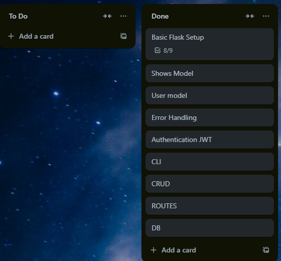
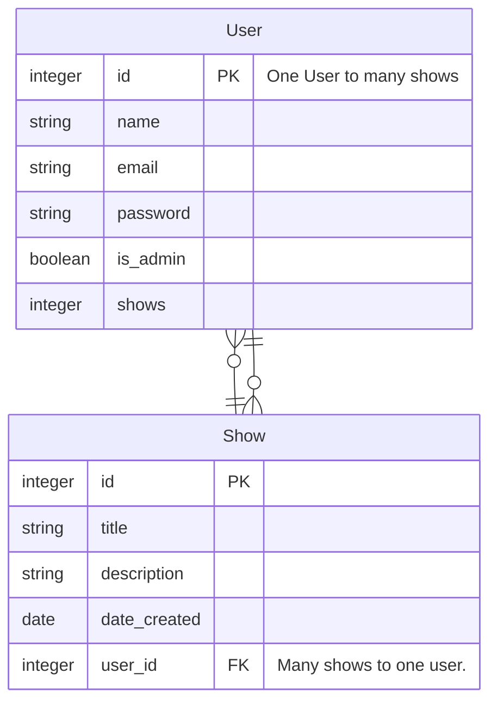

<h1 style="text-align:center">T2A2 - API Webserver</h1>

<h2 style="text-align:center">Table of Contents</h2>

- [R1 - Explain the problem that this app will solve, and explain how this app solves or addresses the problem.](#R1)


- [R2 - Describe the way tasks are allocated and tracked in your project.](#R2)
- [R3 - List and explain the third-party services, packages and dependencies used in this app.](#R3)
- [R4 - Explain the benefits and drawbacks of this app’s underlying database system.](#R4)
- [R5 - Explain the features, purpose and functionalities of the object-relational mapping system (ORM) used in this app.](#R5)
- [R6 - Design an entity relationship diagram (ERD) for this app’s database, and explain how the relations between the diagrammed models will aid the database design](#R6)
- [R7 - Explain the implemented models and their relationships, including how the relationships aid the database implementation.](#R7)
- [R8 - Explain how to use this application’s API endpoints.](#R8)

## <h2 style="text-align:center" id="R1">R1 - Explain the problem that this app will solve, and explain how this app solves or addresses the problem.</h2>

As a developer I need to show that I am able to design, implement and test an application programming interface (API) so that I can demonstrate that I am able to use a range of developer tools so that I can prove my learning and understanding of API's and their implementation.

I chose to develop a show page for the basis of a plex clone where a user can upload shows. Real world issue is control of media that is legally purchased and owner by the user.


## <h2 style="text-align:center" id="R2">R2 - Describe the way tasks are allocated and tracked in your project.</h2>

Tasks will be broken down into users stories and features. This will be planned out under the EPICS and managed by a Trello board.



## <h2 style="text-align:center" id="R3">R3 - List and explain the third-party services, packages and dependencies used in this app.</h2>
<details>
<summary>Postgresql</summary>

An open-source relational database. Highly extensible and supportive of advanced data types. 
Robust data integrity/reliability as well as supporting complex queries.
</details>

<details>
<sumamry>Flask</summary>

A lightweight framework for the web using the Python language. 
Small overhead as well as boiler-plate code. 
Some features incude routing, request handling and templates. It is a popular choice used by companies of various sizes accross the industry.
</details>

<details>
<summary>SQLAlchemy</summary>

An Object-Relational Mapping (ORM) library for Python. The connection between Flask and the database. Allows DB entities to be operated upon as Python objects. It simplifies CRUD operations. One of the most popular ORMs.
</details>

<details>
<summary>Marshmallow</summary>
An "ORM/ODM/framework-agnostic library for converting complex datatypes". It enables features like validation upon password lengths.
</details>

<details>
<summary>Bcrypt</summary>
A library for hashing passwords for safe storage. It uses intensive algorithms to increase the difficulty for attempted brute-force attacks.
</details>

<details>
<summary>JWT</summary>
JSON Web Token or JWT an open standard for the faciliation of comms between two entities. 
JWTs ensures secure comms through the use of encription to ensure security.
</details>

## <h2 style="text-align:center" id="R4">R4 - Explain the benefits and drawbacks of this app’s underlying database system.</h2>
<h3 align="center">PostgreSQL Database</h3>

<details>
<summary><b>Benefits</b></summary>

<ul>
    <li>Full atomicity, consistency, isolation, and durability (ACID) compliance. Meaning that the database has good data integrity/reliabiltiy.</li>
    <li>Support for complex queries including but not limited to joins, set operations and subqueries.</li>
    <li>It is considered a relational database meaning that it excels in highly structuing and managing data</li>
</ul>

</details>

<details>
<summary>Drawbacks</summary>

<ul>
    <li>Higher vunerability to cyber attacks. e.g. SQL injections</li>
    <li>As a relational database it doesn't have the best support for hierachical data</li>
    <li>Performance overhead requirements when compared to other options this is in part because of its strict ACID compliance</li>
</ul>


</details>


## <h2 style="text-align:center" id="R5">R5 - Explain the features, purpose and functionalities of the object-relational mapping system (ORM) used in this app.</h2>
The ORM used in this application is SQLAlchemy.

SQLAlchemy is an Object-Relational Mapping (ORM) library for Python. The connection between Flask and the database. Allows DB entities to be operated upon as Python objects. It simplifies CRUD operations. One of the most popular ORMs.

Some examples of use in this application are:

Used for defining and querying tables.
```python
class Show(db.Model):
    __tablename__ = 'shows'
    id: Mapped[int] = mapped_column(primary_key=True)
    title: Mapped[str] = mapped_column(String(100))
    description: Mapped[Optional[str]] = mapped_column(Text)
    date_created: Mapped[date] = mapped_column(default=date.today)
    user_id: Mapped[int] = mapped_column(ForeignKey('users.id'))
    user: Mapped['User'] = relationship('User', back_populates='shows')
```


## <h2 style="text-align:center" id="R6">R6 - Design an entity relationship diagram (ERD) for this app’s database, and explain how the relations between the diagrammed models will aid the database design</h2>




## <h2 style="text-align:center" id="R7">R7 - Explain the implemented models and their relationships, including how the relationships aid the database implementation.</h2>

An explanation of the User and Show entities, their relationships, and how these relationships aid the postgres database implementation:

<details>
<summary>User Model</summary>

## <h4 style="text-align:center">Table:</h4>

```
users
```

## <h4 style="text-align:center">Attributes:</h4>

 `id` : Integer - Primary Key

 `name`: String - Optional

 `email`: String - Unique (Required for all users, used for authentication and user identification)

 `password`: String - Holds hashed password of associated user.

 `is_admin`: Boolean - A flag for whether a user has admin privlidges, default is false.

## <h4 style="text-align:center">Relationships:</h4>

`shows`: Relationship to the show model. This is a one-to-many relationship. A single user can be associated with many shows.

```python
shows: Mapped[List['Show']] = relationship('Show', back_populates='user')
```

</details>

<details>
<summary>Show Model</summary>

## <h4 style="text-align:center">Table:</h4>

```
shows
```

## <h4 style="text-align:center">Attributes:</h4>


 `id` : Integer - Primary Key

 `title`: String 100 Char max.

 `description`: String - Optional

 `date_created`: Date - Stores when the show data was created, default current date.

 `user_id`: Integer - A foreign key that references the ```users``` table ID. This will link the created show to the user who created it.

## <h4 style="text-align:center">Relationships:</h4>

```user```: Relationship to the user model. This is a many to one relationship. Many shows can be associated with one user.

```python
user: Mapped['User'] = relationship('User', back_populates='shows')
```

</details>

## <h4 style="text-align:center">Schema Definitions:</h4>

```UserSchema```: Used to serialize/validate ```user``` objects.<br>
```ShowSchema```: Used to serialize/validate ```show``` objects.

## <h4 style="text-align:center">Database Aid:</h4>

```Foreign Key Constraint```:<br>

```user_id``` from the ```show``` model. Will enforce referntial integrity. Ensuring every show is correctly associated with a valid user from the ```user``` table.

```One-to-Many Relationship```:<br>

The ```User-Show``` allows for more efficient organization of the data, where a user is able to create and manage multiple shows.

```Efficient Data Access```:<br>

Utilizing the ```relationship()``` method from SQLAlchemy allows for data to be easily accessable. E.g. accessing all shows that a user has created is a straightforward by calling ```user.shows``` and in reverse by accessing the the user who created a show through the ```show.user``` call.

```Data Validation and Serializaiton```: <br>

Marshmallow schemas can provide a clean and conscise way to serialize, validate and deserialize the models. 

## <h2 style="text-align:center" id="R8">R8 - Explain how to use this application’s API endpoints.</h2>
<details>
<summary>Users - Endpoints</summary>


| Method    | URL                                        | Description                              | Body Requirements  | Authentication Required |
| --------  | ----------------------------------------   | ---------------------------------------- |--                  |--
| `GET`     | `/users`                                   | Retrieve all users.                      |  `n/a`             |
| `GET`     | `/users/<int:id>`                           | Retrieve user by ID                      |  `n/a`             |
| `POST`    | `/users/login`                             | Login as a user.                         | `{"email":"{text}","password": "text"}` |
| `POST`    | `/users/login`                             | Login as a admin.                        | `{"email":"{text}","password": "text"}` |
| `POST`    | `/users` | Admin Only - Create a new user. |`{"email": "{text}","password": {"text"},"name": "{text}",is_admin":{boolean}`| `{Bearer Token}` |
| `PATCH`   | `/users/<int:id`                           | Admin Only - Update User                 |`{"email":{"text"},"is_admin": {boolean},"name":{text"},"password":"{text}"}`| `{Bearer Token}`  |
| `DELETE`  | `/users/<int:id>`                        | Admin Only - Delete a User by ID         | | `{Bearer Token}` |

</details>

##

<details>
<summary>Shows - Endpoints</summary>


| Method   | URL                                        | Description                              | Body Requirements  | Authentication Required |
| -------- | ----------------------------------------   | ---------------------------------------- |--                  |-- |
| `GET`    | `/shows`                                   | Retrieve all shows.                      |  `n/a`             |
| `GET`   | `/shows/<int:id>`                           | Retrieve show by ID                      |  `n/a`             |
| `POST`   | `/shows`                             | Create a new show.                    | `{"title": "{string}}","description": "{string}` | `{Bearer Token}`
| `PATCH`  | `/shows/<int:id`                           | Admin Only - Update Show by ID              |`{"title":{string},"description":"{string}"`|`{Bearer Token}` |
| `DELETE`   | `/shows/<int:id>`                        | Admin Only - Delete a Show by ID         | | `{Bearer Token}` |

</details>

##


